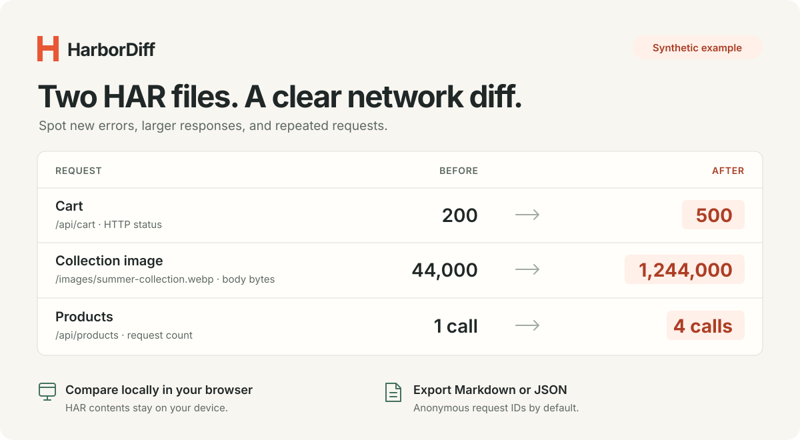

# HarborDiff

**What changed on the wire?** Compare two HAR captures and turn network changes into an issue-ready report.

[Open the app](https://Wildchiken.github.io/harbor-diff/) · [Try the CLI](#command-line) · [How matching works](#how-matching-works) · [中文](README.zh-CN.md)



Drop in a capture from before your change and one from after it. HarborDiff puts new requests, HTTP errors, larger responses, repeated calls, and slower request groups in one view. Copy a Markdown summary or download JSON.

- **Local files stay local.** The app parses captures in your browser. No upload service, account, tracking, remote font, or API key.
- **Understand each comparison.** Match by HTTP method and URL, preserve repeated requests, and explicitly choose which query parameters to ignore.
- **Share less data.** Reports use resource IDs by default. URL output is optional, and query values are always redacted.
- **Use the same engine anywhere.** A browser app and a dependency-free Node CLI share the comparison code.
- **See missing evidence.** Unknown sizes and timings remain unknown, with coverage reported alongside totals.

## Quick start

Open the [web app](https://Wildchiken.github.io/harbor-diff/) and select **Try the demo**. The included capture pair is synthetic: a storefront serves a larger image, repeats an API request, and starts returning an HTTP error. No real browsing data is included.

To compare your own captures:

1. Export a HAR from your browser's Network panel before the change.
2. Reproduce the same flow after the change, with comparable cache, device, and network settings, and export another HAR.
3. Load the two files in HarborDiff. Inspect the changes and matching settings.
4. Copy the summary into your issue or download the report.

HAR files may contain credentials and personal information. You do not need to publish them to use this app. Default reports omit request URLs and input file names; adding URL paths can reveal private data, so review that output before sharing.

## Command line

Node.js 20 or newer. There are no runtime dependencies.

```sh
git clone https://github.com/Wildchiken/harbor-diff.git
cd harbor-diff
node bin/harbor-diff.js --demo
node bin/harbor-diff.js before.har after.har
```

Write a structured report or choose matching settings:

```sh
node bin/harbor-diff.js before.har after.har --format json > report.json
node bin/harbor-diff.js before.har after.har --ignore-query v,cacheBust
node bin/harbor-diff.js before.har after.har --min-duration-ms 200 --min-bytes 10240
node bin/harbor-diff.js before.har after.har --include-urls
```

For a deterministic check in your existing capture workflow:

```sh
node bin/harbor-diff.js before.har after.har --fail-on errors
```

Exit codes: **0** for a completed comparison, **1** for invalid input or an operational error, **2** when an explicitly requested `--fail-on` category is present. Available categories are `added`, `removed`, `errors`, `bytes`, `duration`, and `count`. A fail-on result is a signal to inspect, not a conclusion about what caused the change.

## How matching works

Requests are grouped by HTTP method and normalized URL. Query parameters are sorted for matching; their values still matter unless you explicitly ignore a parameter. URL credentials and fragments do not define a group. Repeated requests are aggregated rather than paired by their position in the file.

This makes the matching easy to inspect, but it has boundaries:

- Requests with the same method and URL share a group, even when their request bodies differ. HarborDiff does not compare payloads or GraphQL operations.
- Different asset names remain added and removed resources. Hashed filenames are not guessed to be the same resource.
- Ignoring a query parameter can merge requests that have different meanings. Choose only parameters that are irrelevant for your comparison.
- A file containing multiple page navigations is analyzed as one capture. Use comparable capture scopes.

Response-body bytes come from HAR `response.bodySize`. They are not total wire bytes or decoded content size. Unknown values are excluded from known totals and reported as coverage gaps; they are not zeros. Timing comparisons use the median request duration within each group, not page-load time or Core Web Vitals.

Flags focus on increases, newly observed HTTP errors, added groups, and removed groups. Smaller or faster matched groups remain visible with their negative deltas, but are not flagged. HTTP error flags cover statuses 400–599; missing or zero statuses are unknown, so this version does not classify browser or network failures.

One capture before and one after show **observed differences**. Caching, network variability, workload, and capture settings can all change the result. HarborDiff does not infer root causes or statistical significance.

## Run the web app locally

```sh
npm start
```

Open `http://127.0.0.1:4173`. No install or build step is required. To use another port, set `HARBORDIFF_PORT`. The local server binds only to loopback and serves the app's public files.

The app is also a plain static site: serve `index.html`, `styles.css`, `src/`, and `assets/` on your preferred static host. No backend is needed.

## Development

```sh
npm test
```

The tests cover matching, repeated requests, unknown metrics, report privacy, and CLI behavior. See [CONTRIBUTING.md](CONTRIBUTING.md) for the small-project contribution workflow.

## Related tools

[sitespeed.io Compare](https://github.com/sitespeedio/compare) offers rich HAR and performance comparisons. [harlite](https://github.com/brucehart/harlite) provides a CLI for HAR analysis, reports, and budgets. [HTTP Toolkit](https://github.com/httptoolkit/httptoolkit) is a broader HTTP debugging environment. HarborDiff is a focused option for comparing two captures and explaining the result in a compact report.

## Feedback

If HarborDiff helps you understand a network change, a star helps other developers discover it. The most useful feedback is the task you tried, what was confusing, and a minimal synthetic example. Please avoid attaching real HAR captures to public issues.

MIT licensed. See [LICENSE](LICENSE) and [SECURITY.md](SECURITY.md).
